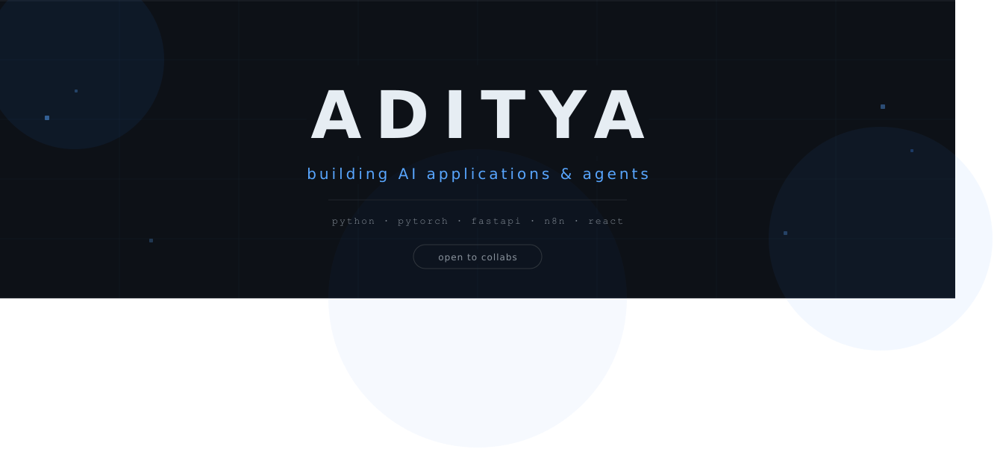

 

---

### hey.

i'm aditya. i train models, build agents, and occasionally convince LLMs to do useful things on the first try.

my day is split between wrangling pytorch, chaining together n8n workflows that probably shouldn't work but do, and asking "why is the loss going up" more times than i'd like to admit.

when i'm not staring at loss curves, i'm in the gym, watching films, or arguing about sports with people who are statistically wrong.

> built StatMind AI — turns your documents into stats and insights, because reading is overrated. then built Servician, a RAG-based service bot that actually answers questions instead of making you scroll through 40 pages of documentation.

---

### what i work with

also: `n8n` &nbsp;·&nbsp; `LangChain` &nbsp;·&nbsp; `RAG pipelines` &nbsp;·&nbsp; `REST APIs`

---

### things i've shipped

<b>StatMind AI</b>

 
converts documents into statistics and data insights.

<b>Servician</b>

 
RAG-based service bot — context-aware, actually helpful.

---

### github, quantified

<b>contribution activity graph</b>

---

*open to collabs, interesting problems, and people who take their craft seriously.*

