<div align="center">



<a href="https://github.com/inslot2525-ctrl">
  
</a>

<br/>

[](https://www.linkedin.com/in/aditya-chimurkar25)
[](https://vitejs-vite-duplicat-e9jc.bolt.host/)
[](https://github.com/inslot2525-ctrl?tab=followers)


</div>

---

### 👋 hey, i'm aditya

i train models, build agents, and occasionally convince LLMs to do useful things on the first try.

```python
class Aditya:
    location   = "India 🇮🇳"
    role       = "AI / ML Engineer (in the making, shipping anyway)"
    focus      = ["multi-agent systems", "RAG pipelines", "LLM safety & red-teaming", "graph ML"]
    shipping   = ["FRECTION", "TokenWise", "StatMind AI", "EyesUp"]
    hackathons = ["iQOO Hackathon Winner 🏆", "SIH Winner 🏆", "2x Hackathon Finalist"]
    off_hours  = ["gym", "films", "arguing about sports with people who are statistically wrong"]

    def debug(self):
        return "why is the loss going up"  # asked more often than i'd like to admit
```

---

### 🚀 featured builds

<table>
<tr>
<td width="50%" valign="top">

#### 🕸️ [FRECTION](https://github.com/inslot2525-ctrl/FRECTION)
Finds coordinated fraud rings, not just single suspicious transactions. Combines GNN embeddings, Isolation Forest and community detection on the transaction graph.

`GNN` `PyTorch` `Graph Analytics`

</td>
<td width="50%" valign="top">

#### ⚡ [TokenWise](https://github.com/inslot2525-ctrl/Tokeniser)
Agentic prompt pipeline: **plan → enhance → compress → route → verify**. Saves ~40–60% tokens, routes in under 250 ms locally and catches 25+ jailbreak patterns.

`Python` `Agents` `LLM Routing`

</td>
</tr>
<tr>
<td width="50%" valign="top">

#### 📊 [StatMind AI](https://github.com/inslot2525-ctrl/STATMIND-AI)
*"Your data walked in raw. It left with a PhD."* Upload a CSV and get stats, auto-charts, target suggestions, leakage reports, ML models and AI insights.

`FastAPI` `React` `scikit-learn`

</td>
<td width="50%" valign="top">

#### 🛵 [EyesUp](https://github.com/inslot2525-ctrl/EyesUp)
On-device Android copilot for gig drivers. It scores each incoming order against every other live offer and speaks the verdict in Marathi, Hindi or English. Nothing leaves the phone.

`On-device NLU` `Android` `Voice`

</td>
</tr>
<tr>
<td width="50%" valign="top">

#### 🛡️ [LLM Red-Team Harness](https://github.com/inslot2525-ctrl/LLM--HARNESS)
Attacks your LLM before users do: generates adversarial and prompt-injection variants, scores the model's behaviour, suggests prompt hardening and writes a safety report.

`Next.js` `FastAPI` `TypeScript` `LLM Safety`

</td>
<td width="50%" valign="top">

#### 🌊 [ORCA](https://github.com/inslot2525-ctrl/ORCA-Marine-system)
**Smart India Hackathon 2025 · ISRO problem statement.** 8 collaborating agents reason over satellite ocean data (SST, chlorophyll, weather) through chat in 10 Indian languages.

`Multi-Agent` `Earth Observation` `JavaScript`

</td>
</tr>
<tr>
<td width="50%" valign="top">

#### 🔎 [Rivalyze](https://github.com/inslot2525-ctrl/Rivalyze)
Type a company name, get a market brief. It runs 8 parallel searches (news, finance, jobs, pricing and more) and turns them into one dashboard.

`Agents` `Python` `Web Intelligence`

</td>
<td width="50%" valign="top">

#### 📡 [IICWMS](https://github.com/inslot2525-ctrl/IICWMS)
Multi-agent monitoring for IT and cloud workflows. Agents read the workflow logs, flag inefficiencies, anomalies and compliance violations, and show the fixes on a live dashboard.

`Multi-Agent` `Python` `Anomaly Detection`

</td>
</tr>
</table>

<details>
<summary><b>more projects →</b></summary>
<br/>

| project | what it does |
|---|---|
| [**SABOT**](https://github.com/inslot2525-ctrl/SABOT) | RAG sales-intelligence assistant with evidence-backed answers and lead capture |
| [**Servician**](https://github.com/inslot2525-ctrl/Servician-) | RAG service bot that answers from your docs so you don't scroll 40 pages |
| [**MeetFlow**](https://github.com/inslot2525-ctrl/MeetFlow) | meeting transcripts to structured tasks with a DeBERTa classifier |
| [**LangGraph Agents**](https://github.com/inslot2525-ctrl/LANGGRAPH_AGENTS) | LangGraph agent patterns and experiments |
| [**CPU Scheduling Food Sim**](https://github.com/inslot2525-ctrl/cpu-scheduling-food-simulator) | OS scheduling algorithms explained with a restaurant kitchen |

</details>

---

### 🛠️ what i work with

<div align="center">

[](https://skillicons.dev)

<br/>


</div>

---

### 🔥 recently active

<sub>auto-updated every 12 hours by a GitHub Action</sub>

<!--RECENT:START-->
| project | what it is | stack | last push |
|---|---|---|---|
| [**Rivalyze**](https://github.com/inslot2525-ctrl/Rivalyze) | Competitive-intel agent: 8 parallel searches into one brief | `Python` | 8d ago |
| [**MeetFlow**](https://github.com/inslot2525-ctrl/MeetFlow) | Meeting transcripts to structured tasks with DeBERTa | `TypeScript` | 11d ago |
| [**EyesUp**](https://github.com/inslot2525-ctrl/EyesUp) | On-device voice copilot for gig drivers (iQOO Hackathon 2026) |  | 20d ago |
| [**FRECTION**](https://github.com/inslot2525-ctrl/FRECTION) | Fraud-ring detection with GNNs + graph analytics | `Python` | 23d ago |
| [**STATMIND-AI**](https://github.com/inslot2525-ctrl/STATMIND-AI) | Upload a CSV, get stats, ML models and AI insights | `Python` | 23d ago |
| [**ORCA-Marine-system**](https://github.com/inslot2525-ctrl/ORCA-Marine-system) | 8-agent marine intelligence platform (SIH 2025, ISRO) | `JavaScript` | 24d ago |
<!--RECENT:END-->

---

<div align="center">
  <picture>
    <source media="(prefers-color-scheme: dark)" srcset="https://raw.githubusercontent.com/inslot2525-ctrl/inslot2525-ctrl/output/github-snake-dark.svg"/>
    <source media="(prefers-color-scheme: light)" srcset="https://raw.githubusercontent.com/inslot2525-ctrl/inslot2525-ctrl/output/github-snake.svg"/>
    
  </picture>
</div>

---

<div align="center">

**open to opportunities, collabs, interesting problems, and people who take their craft seriously.**

[](mailto:chimurkar.aditya@gmail.com)


</div>
